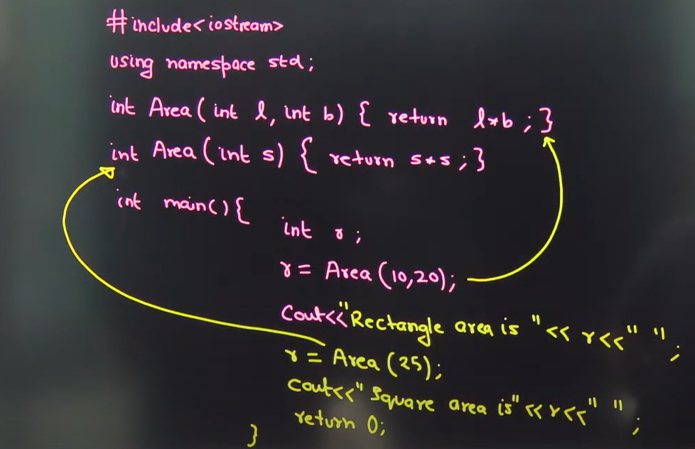
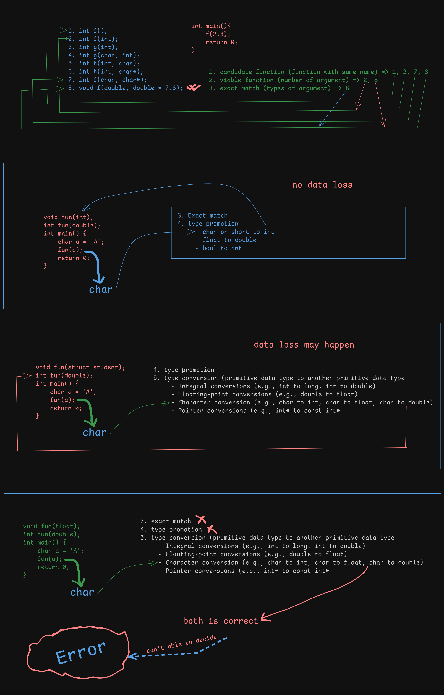

# Cplusplus
Learning c plus plus programming language


# **Notes**
- C++ is a Object Oriented Programming Language
- C++ is a superset of c language

**Software**
- Console based application
- GUI application
- Web application
- System application : OS
- Mobile application

### Here we will learn about **Console based application and Object Oriented Concept**
There are two approaches to make a software -

1. Procedure Oriented
2. Object Oriented
Example : 
1. C is a procedure oriented programming language.
2. C++ is object oriented programming language

Although C++ is procedure and object oriented programming language because C++ is superset of C language
When a class is created then these two things will defined
1. Variable/Properties
2. Method

In some other class one extra things are there that is
1. Opertor 
**Examples**
- object.variable
- object.function()
- Class contains description of an object
- Class contains properties/variable or methods/function
As a class contains properties
- properties will same for all object
- properties value may or may not same

Example : 
In a class there is properties called age , so for a object like Ram age 16 but Shyam age 65
    Whenever an action(method/function) is performed then the state of that object may or may not be changed.
```c++
#include<iostream>
using namespace std;
int main() {
    cout << "Hello World" << endl;
}
```
<h1 style="font-size: 50px; font-weight: bold; font-family: JetBrains Mono NL; color: aqua; ">function()</h1>

### **inline keyword**

```c++
inline
```
- inline is keyword used for optimization purpose
- inline is a request to compiler

inline keyword request the compiler if possible then expand the code only.
Actually in function there are some advantage and disadvantages like

- **Advantages**
    - reusability of code
    - easily maintainance
    - readablity

- **Disadvantages**
    - Memory waste for small code like sum of two number
    - Increases execution time

So, to utilize function advantages and avoid disadvantages we are used inline keyword.

if the code is small the inline keyword expand the code of function to the object file. and if the code is large it will not expand the code in object file.

if there is any loop, recursion, switch in function then compiler will expand the code in object file if the code is small.
**Example**

use inline keyword in declaration
```c++
#include<iostream>
using namespace std;
inline int calculateCube(int); // inline keyword
int main()
{
    cout << endl << endl;

    int number, result;
    cout << "Enter a number: ";
    cin >> number;

    result = calculateCube(number);
    cout << "value: " << result;

    cout << endl << endl;
    return 0;
}

int calculateCube(int num){
    return num*num*num;
}
```
### **default argument**

in the following example of c++ code I used default argument.
if user not provide the values then also this code will run for three argument without any error

*Rules :*
- Default argument are right aligned
    - Example :
        - valid:
            1. int add(int=0, int=0, int=0)
            2. int add(int, int=0, int=0)
            3. int add(int, int, int=0)
        - invalid:
            1. int add(int=0, int, int)
            2. int add(int=0, int=0, int)
            3. int add(int, int=0, int)
    
    You will face an error if you used invalid declaration
        
- You can give the default values only once either declaration time or definition time

```c++
    // Error one example
    #include<iostream>
    -----
    int add(int, int=0, int=0); 
    int main()
    {
        -----
        -----
        -----
    }

    int add(int a, int b=0, int c=0){ // again default value provides
        ----
        ----
        ----
    }


    // Error two example
    /*
        Although you are set default values only once.
        if you provides less than 3 argument in program the you will face error because the forward declaration of add is with 3 arguments (too few arguments)

        to avoid this error write the definition of the function before main function
    */
    #include<iostream>
    -----
    int add(int, int, int); 
    int main()
    {
        -----
        -----
        -----
    }

    int add(int a, int b=0, int c=0){ // agian default value provides
        ----
        ----
        ----
    }
```

Example :
```c++
#include<iostream>
using namespace std;
int Add(int=0, int=0, int=0); // default values set to zero

int main()
{
    cout << endl;

    int x = 45;
    int y = 20;
    int z = 10;

    // uses of the function Add()
    cout << "the sum : " << Add() << endl;
    cout << "the sum of " << x << " is : " << Add(x) << endl; 
    cout << "the sum of " << x << " + " << y << " is : " << Add(x+y) << endl;
    cout << "the sum of " << x << " + " << y << " + " << z << " is : " << Add(x+y+z) << endl;
    cout << endl;
    return 0;
}

int Add(int firstNum, int secondNum, int thirtNum)
{
    return firstNum+secondNum+thirtNum;
}
```

### **reference variable**
There are some type of variable in c
- normal variable
    - int a = 10;
- pointer variable
    - int *b = &a;

But in C++ there are one extra type of variable 
- reference variable
    - int &c = a;


Description of **reference variable**
- reference variable is a alise of that variable which you want to assign. 
- it is a nickname of original variable.
- there is no physical address of reference variable.
- in above example address of c is as same as address of a.
- After assign &c = a , you can't assign any other varible to it like &c = z, it is not possible.
- If you change anything in c it will reflect in a also vice versa.
- You can create so many reference variable of a variable.
- You can't assign null to a reference variable. (int &x = null --> error)
- You can't only declare reference variable , you must have to initialize it with a variable otherwise you will face error. 
    - example
        - int &y; --> error
        - int &y = a; --> ok


Difference between a pointer variable and reference variable :
- you can reassign pointer variable to any other address but you can't reassign reference variable.
- you can declare pointer variable, and you can assign null to it but in reference variable you can't do it.
- in pointer variable memory will allocate but in reference variable memory will not allocate further. 
- you can access related address by increment or decrement in pointer variable but in reference variable it is not possible.
- pointer variable is little bit hard but reference variable is easy.
**Example of Program**

```c++
#include<iostream>
using namespace std;
int main()
{
    cout << endl;

    int a = 10;
    int *b = &a;
    int &c = a;

    c = c+20;
    cout << a << endl;
    a = a+1;
    cout << c << endl;

    if(&c == &a) cout << "Denotes same memory location." << endl;
    cout << "Prove : " << endl << 
                "\taddress of a : " << &a << endl << 
                "\taddress of c : " << &c << endl << endl;
    return 0;
}
```
**Output of program**

```c++
30
31
Denotes same memory location.
Prove :
        address of a : 0xb44bdffa5c
        address of c : 0xb44bdffa5c
```

<p style="font-size: 40px; color: rgb(0, 175, 58); font-weight: bold;">Call by value</p>

```c++
    #include<iostream>
    using namespace std;

    void f(int, int); // call by value

    int main()
    {
        cout << endl;

        // call by value
        f(10, 15);

        cout << endl;
        return 0;
    }

    void f(int a, int b){
        cout << a << " + " << b << " = " << a+b << endl; 
    }
```

<hr/>

**output**

```c++
10 + 15 = 25
```


<p style="font-size: 40px; color: rgb(0, 175, 58); font-weight: bold;">Call by address</p>


```c++
    #include<iostream>
    using namespace std;
    void fun(int *, int *); // call by address

    int main()
    {
        cout << endl;

        // call by address
        int a = 10, b = 20;
        fun(&a, &b);

        cout << endl;
        return 0;
    }


    void fun(int *num1, int *num2){
        cout << *num1 << " + " << *num2 << " = " << *num1 + *num2 << endl;
    }

```

<hr/>

**output**

```c++
10 + 20 = 30
```

<p style="font-size: 40px; color: rgb(0, 175, 58); font-weight: bold;">Call by reference</p>

```c++
    #include<iostream>
    using namespace std;

    void function(int &, int &); // call by reference

    int main()
    {
        cout << endl;

        // call by reference
        int m = 50, n = 40;
        function(m, n);

        cout << "value of m: " << m << ", " << "value of n: " << n << endl;
        cout << endl;
        return 0;
    }

    void function(int &num1, int &num2){
        cout << num1 << " + " << num2 << " = " << num1 + num2 << endl;
        num1 = 23;
        num2 = 32;
    }
```
<hr/>

**output**

```c++
50 + 40 = 90
value of m: 23, value of n: 32
```

question: tell me here what is x in cin (call by value/call by address/call by reference)
```c++
    int x;
    cin >> x;
```

answer: call by reference
as we can assign/change the value of x.

    call by value -> in call by value we can't change or update the value.
    call by reference -> if it is call by reference then it looks like : cin >> &x.
### **function overloading**
- multiple function with same name

```c++

return_type function_name(arguments)
            <---------------------->
              signature of function


for function overloading signature of function must be unique.

```
**Description of function overloading**
- number of argument must be different or type of argument must be different
- function selection (overload resolution) is perfomed by compiler -> also know as binding
- function selection is based on number of argument or types of argument
- same signature but different return type is not a function overloading.
    - int fun(int a)
    - void fun(int x)
- binding is decided in compile time
    - binding is which function will execute in function overloading


**Example of function/method overloading**

```c++
    #include<iostream>
    using namespace std;

    // method overloading
    int max(int, int, int, int);
    int max(int, int, int);
    int max(int, int);

    int main()
    {
        cout << endl;

        cout << "Max of (1, 7, 8, 11) : " << max(1,7,8,11) << endl;
        cout << "Max of (1, 8, 6) : " << max(1,8,6) << endl;
        cout << "Max of (8, 6) : " << max(8,6) << endl;

        cout << endl;
        return 0;
    }

    int max(int a, int b, int c , int d)
    {
        if(a > b){
            if(a > c){
                if(a > d) return a;
                return d;
            }
            else{
                if(c > d) return c;
                return d;
            }
        }
        else{
            if(b > c){
                if(b > d) return b;
                return d;
            }
            else{
                if(c > d) return c;
                return d;
            }
        }
    }

    int max(int a, int b , int c)
    {
        return a > b ? a > c ? a : c : b > c ? b :c;
    }

    int max(int a, int b)
    {
        return a > b ? a : b;
    }

```


**Summary of binding process**

- Identify candidate functions by name.
- Filter to viable functions that match the argument list.
- Select the best match based on exact matches and conversions.
  - Exact matches (no conversion needed).
  - type Promotions (e.g., int to double).
  - Standard conversions (e.g., float to double).
  - User-defined conversions (like conversion operators or constructor calls, which are less preferred).
- Check for ambiguity; if ambiguous, report a compile-time error.
  
```c++
        int f(double);
        void f(double, double=2.5); 
        //here compile will throw an error

        int main()
        {
                f(3.6);
        }
```
- Bind the function if a single, best match is found

